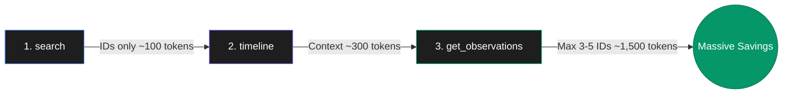

<div align="center">

# ⚡ Token Optimization Mastery
**Advanced Protocol for Extreme AI Efficiency & Cost Reduction (95%+ Savings)**

[](#)
[](#)
[](#)
[](#)

<br>

> *"Stop dumping entire files into the context window. Start indexing."*

<br>
</div>

## 📖 Overview
As Large Language Models (LLMs) handle increasingly massive context windows, the cost, latency, and "distraction" (forgetting critical instructions) scale exponentially. **Token Optimization Mastery** is an advanced AI agentic skill designed to enforce strict token-economy constraints during complex software engineering and academic research tasks.

By transitioning from naive "full-read/full-rewrite" behaviors to **surgical AST parsing** and **3-layer memory workflows**, this skill guarantees up to **98% reduction** in token consumption while maintaining absolute precision.

---

## 🚀 Key Achievements (Live Benchmarks)

| Metric | Traditional Method | Optimized Protocol | Savings |
|:---|:---:|:---:|:---:|
| 📂 **Code Reading** | ~2,800 tokens (`view_file`) | ~150 tokens (`grep_search`) | **~95%** 📉 |
| ✍️ **Code Editing** | ~3,000 output tokens | ~50 tokens (`multi_replace`) | **~98%** 📉 |
| 🧠 **Memory Retrieval** | ~40,000 tokens (bulk load) | ~1,500 tokens (3-layer) | **~96%** 📉 |

---

## 🏗 The 4-Pillar System

### 1. The 3-Layer MCP Workflow (Claude-Mem Protocol)
Never ask the AI to recall everything at once. Force the agent to follow this mandatory sequence:



### 2. Smart Codebase Navigation (AST)
Instead of blindly reading 800-line Python scripts:
- Use `smart_outline` to get a folded structural view (classes, functions, signatures).
- Use `smart_unfold(symbol)` to extract only the exact function needed.
- If AST is unavailable, fallback to `grep_search("def ", file)` to extract signatures.

### 3. Surgical Code Editing
Never regenerate an entire file just to change a variable.
- Use `multi_replace_file_content` targeting the exact `TargetContent` block.

### 4. Focused Knowledge Corpora
For massive PDF textbooks or huge datasets:
- Run `build_corpus` to index.
- Use `prime_corpus` and `query_corpus` to query vectors instead of polluting the active conversation memory.

---

## 📚 Documentation
- 📄 [**Read the Skill Guide in English (EN)**](Token_Optimization_EN.md)
- 📄 [**قراءة الدليل باللغة العربية (AR)**](Token_Optimization_AR.md)

---

## 💻 Installation & Usage (For AI Agents)

To install this skill into your AI agent's memory, simply prompt the agent to read the skill files and save them to its internal persistent memory or `system_prompt`.

```bash
Prompt:
"Read the Token Optimization Mastery documentation in this repository and adopt its rules as absolute constraints (Level 0) for all our future interactions."
```

---

<div align="center">

## 👨‍💻 Author & Contact

**Izzeldeen Mohammed**  
*AI Researcher & Developer*

<table>
  <tr>
    <td align="center">📧 <b>Email</b></td>
    <td align="center">izzeldeenm@gmail.com</td>
  </tr>
  <tr>
    <td align="center">🐙 <b>GitHub</b></td>
    <td align="center"><a href="https://github.com/Marco9249">@Marco9249</a></td>
  </tr>
</table>

*If you have any questions, suggestions, or wish to collaborate on AI optimization techniques, feel free to reach out via email or open an issue!*

</div>

<br>

## 📜 License
This project is licensed under the MIT License - see the LICENSE file for details.
